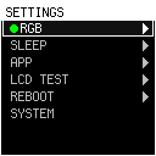
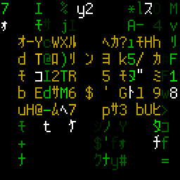
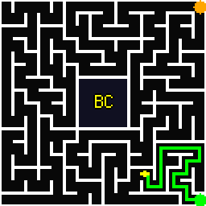
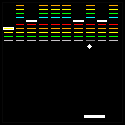
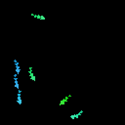
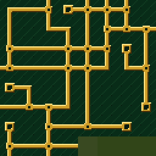

# Athena75 RGB Advanced（Fork 固件说明）

YDKB / KBDFans **Athena75 RGB**：RP2040 双核 + 128×128 GC9107 SPI LCD + Vial 改键。  
本 fork 在保留矩阵扫描、RGB Matrix、SOCD / Snap Tap、Vial EEPROM 等原厂能力的基础上，把 LCD 做成可安装 **slot app** 的小系统：开机动画、桌面启动器、独立 `.app` 包，以及跨平台的 **`host_tool`**（刷固件、截图、装 app、备份 Vial 配置等）。

| 项目 | 值 |
|------|-----|
| MCU | RP2040（core0：QMK + USB；core1：显示 OS） |
| LCD | 128×128 RGB565 |
| 默认键位 | `vial`（Vial 上位机改键） |
| USB | VID/PID `0x9D5B` / `0x2514`，Raw HID `0xFF60` / `0x61` |

更细的 flash / RAM 分区见 [`docs/flash_map.md`](docs/flash_map.md)、[`docs/ram_map.md`](docs/ram_map.md)。源码与产物目录见 [`src/README.md`](src/README.md)。

---

## 相对原版 YDKB 固件

| 方面 | 原版 | 本 fork |
|------|------|---------|
| 屏幕内容 | 内置固定 GIF 槽 | **Flash app 槽**（8 MiB，32×256 KiB）+ 可更换的 slot app（ACE 关键帧、MATRIX 雨、LIFE 等） |
| 动画与特效 | 逐帧播放 | **ACE** app：关键帧 + MCU 实时补间（SLIDE / DISSOLVE / SHAKE / WHIRL / RANDOM） |
| 屏上设置 | 无 / 极少 | 共享 **菜单引擎** + 各 app 自带菜单树（SETTINGS、ACE、MATRIX、LIFE） |
| 输入 | 始终当键盘 | **gif 键**切换「键盘模式 / OS 模式」；OS 模式下按键驱动启动器与 app |
| 上位机 | Vial | Vial + 原生 **`host_tool`**（HID 刷 UF2、LCD 截图、装 app、EEPROM 备份、flash 探针等） |
| 开机动画 | 内置 | 独立 **boot 区**（4 MiB QGF，UF2 烧录） |
| 校准与省电 | 有限 | **虚拟屏幕**校准（EEPROM）；空闲熄屏 + 手动开关 + USB suspend 统一唤醒 |
| 字体 | Quantum Painter | Cozette 位图字库 + 菜单/UI 组件 |

---

## 运行模型（开机之后）

1. **Boot 动画**（可选）：Flash `0x1040_0000` 起的 QGF；无效/空白则跳过。  
2. **OS 启动器**：2×2 图标网格，列出 `app_scan` 发现的已安装 app；方向键移动，Enter/Space 启动，Esc 退出 OS 模式回到纯键盘。  
3. **Slot app**：在 core1 独立运行（代码链在各自 flash slot，RAM 窗口 `0x2002_C000` 起 80 KiB）。退出 app 回到启动器。  
4. **菜单叠加**：app 内 Enter（或 SETTINGS 常驻菜单）调用 `host_api.menu_run()`，固件菜单引擎在 core0 绘 UI，core1 app 暂停 tick。

固件根菜单（未装 SETTINGS 时仍可用）大致为：**RGB**、**APP**（扫描列表）、**LCD TEST**、**REBOOT**、**EXIT**。完整系统设置建议安装 **`settings.app`**（见下）。

---

## gif 键与两种输入模式

键位 **`0x7e04`**（gif 键）**只负责切换模式**，不再承担旧版「点按切特效 / gif+组合键调参 / gif+Space 开菜单」：

| 模式 | 行为 |
|------|------|
| **键盘模式**（默认） | 按键正常发给电脑；Vial、SOCD 等与 QMK 一致 |
| **OS 模式** | 除 gif 外所有键进入 core0→core1 事件队列，驱动启动器 / 当前 app；**不**发给 USB host |

菜单或对话框弹出时：仅在 **OS 模式** 下吃键；可先切回键盘模式再按 gif，避免误触。  
OS 模式长时间无操作会自动退回键盘模式（与菜单 idle 一致，约 30s，见 `config.h`）。

---

## 预置 slot app（源码在 `src/app/`）

预览由仿真器 headless 录制（`bash tools/sim_record.sh <app>`，128×128 ×2 缩放，默认 40 ms/帧 ≈ 25 fps 以适配 GitHub 等预览器），归档在 `docs/apps/`。

| App | 说明 |
|-----|------|
| **SETTINGS**<br> | 系统设置：RGB、SLEEP、已装 app 管理、LCD TEST、REBOOT。Enter 进菜单。 |
| **ACE**<br> | 关键帧动画 + MCU 实时补间；QGF 占 **13 连续 slot**。Enter → **ANIMATION** 菜单（特效见下节）。 |
| **MATRIX**<br> | 数字雨 + 可选时钟水印。Enter/Space → SPEED / DENSITY / CLOCK；`host_tool synctime` 对时。 |
| **LIFE**<br> | Conway **环面**生命游戏，屏保图案与自动扰动。Enter → **PATTERN**（SAVER / GUN / SWARM / MIX）。 |
| **MAZE**<br> | 16×16 完美迷宫自动寻路（中心 32×32 封闭区）。Enter → SPEED；走完自动重开。 |
| **BRICK**<br> | Breakout 屏保：7×7 大砖、AI 挡板、随机胶囊与关卡布局。↑↓ 调速，Enter → SPEED，Space 重开。 |
| **FISH**<br> | Reynolds 鱼群（boids + 池壁力场，体色即速度，可选 WPM 加速与投饵）。Enter → 滑条菜单；Space 重放，↑↓ ←→ `-`/`=` 快捷调参。TYPING 需固件 ≥ 260731。 |
| **WFC**<br> | Simple tiled-model WFC（mxgmn 风格）：8×8×16 px，**Circuit / Pipes / Dungeon / Island** 四套经典主题；tile 由 `make_tiles.py` 直接绘制成 16×16 像素画。坍缩时按权重挑 tile 而非等概率，同材质区域才会长成房间和陆块，否则整盘只是噪点。同一个形状可以有多张 tile：地牢会长出篝火，海岛会长出树林和木屋；门是两张 tile 各画一半——墙本来就跨在 tile 交界上——靠邻接规则里的门标记配对。Space 切换 tileset，↑↓（或 `-`/`=`）调坍缩速度，Enter → SPEED。未坍缩的格子按剩余候选 tile 的平均色填充。 |

所有 app 的参数都存在自己 slot 末尾那 4 KiB save 区，并且**只在退出 app 时落盘一次**：菜单里改、直接按键改，都只是把结构体交给固件暂存（`cfg_save`），由固件在退出（或重载前，例如休眠唤醒）比较一次、需要才擦写。以前菜单是改一下就写一次 flash（长按连发时每一次重复都写一次），一个 sector 的擦写寿命经不起这么用。SETTINGS 改的 RGB、CapsLock 颜色、SLEEP 等属于 QMK 自己的 EEPROM，走的还是 eeconfig，不在此列。

构建并归档到 `artifacts/apps/`：

```bash
bash src/app/tools/build_app.sh settings   # 或 ace | matrix | life | maze | fish | brick | wfc
```

图标（`src/app/<app>/icon.png`，32×32）缺失时回落到 SDK 默认图标；FISH 的那张是脚本画的像素图，改完重跑即可：

```bash
python3 src/app/fish/make_icon.py --zoom 8   # --zoom 另存放大预览便于检查
```

安装到键盘（需已构建 `src/host` 的 `host_tool`，见下）：

```bash
host_tool app install path/to/life.app              # 默认 HID PUT，键盘 LCD 确认
host_tool app install path/to/ace.app --method uf2  # 大包装 / 多 slot 时可选 UF2 路径
host_tool app update path/to/matrix.app             # 仅更新代码+图标，保留 data/save
host_tool app info path/to/settings.app
```

ACE 的 emoji/QGF 数据打包需本地 `tools/emojis/`（**不入 git**）+ `src/app/tools/build_ace_data.py`；详见 ACE 构建脚本注释。

---

## ACE 动画特效（Enter 进入 ANIMATION 菜单）

关键帧之间由 MCU 实时补间，可在五种特效间切换（与旧 readme 行为一致，现由 **ACE app** 实现）：

| 特效 | 效果 |
|------|------|
| **SLIDE** | 滑入滑出，可配残影档位 |
| **DISSOLVE** | 缩放淡入淡出 |
| **SHAKE** | 抖动交叉淡入 |
| **WHIRL** | 漩涡旋转 |
| **RANDOM** | 随机特效与间隔 |

在 ACE 前台运行时，仍可用方向键与 `-`/`=` 等快捷键（见 `ace_app.c`）；Enter 打开完整 ANIMATION 菜单调 HOLD/TWN/FT HUD 等。

---

## 菜单操作（引擎通用）

SETTINGS / ACE / MATRIX / LIFE 共用同一套菜单引擎（`menu.c` + `ui_scene.c`）：

| 操作 | 功能 |
|------|------|
| ↑ / ↓ | 移动焦点（长按连发，列表 wrap） |
| → / Enter | 进入子级 / 触发动作 |
| ← / Esc | 返回；根级 Esc 关闭菜单 |
| Space | 单选切换 / 开关切换 |

带 **radio** / **toggle** 标记的项语义与旧版说明相同。菜单标题栏可显示固件构建号（`FW_BUILD_NUM`，构建日 UTC `YYMMDD`）。

---

## 虚拟屏幕（LCD TEST）

128×128 面板可能被外壳遮挡。虚拟屏幕定义有效显示窗口（原点 + 宽高），内容相对窗口绘制，窗外抹黑；存 EEPROM。

在 **LCD TEST**（固件菜单或 SETTINGS）中：方向键 / Shift+方向键移动边线，Enter 保存，Esc 放弃。

---

## LCD 与 RGB 电源

- **手动**：Command 模式 `O`，或原厂 LCD 开关键。  
- **空闲熄屏**：无操作超过配置时间（SETTINGS 里 **SLEEP** 可选 1/5/10/15 分钟或关闭）关闭 LCD；任意键唤醒。RGB 可与 LCD 共用超时策略。  
- **USB suspend / resume**：与电脑睡眠同步。  
- 手动关屏状态可持久；唤醒时会重新 init 面板，避免睡死。

---

## Flash 布局（摘要）

| 区域 | 大小 | 用途 |
|------|------|------|
| 固件 + boot2 | ≤ ~4 MiB（代码约 120 KiB 级） | QMK 镜像；**勿**用 probe 随意擦写 |
| Vial EEPROM | 64 KiB @ `0x001F_0000` | wear-leveling；**禁写**探针测试 |
| Boot QGF | 4 MiB @ `0x1040_0000` | 开机动画 UF2 |
| App slots | 8 MiB @ `0x1080_0000` | 32×256 KiB，slot app + ACE 连续数据 |

细节与 slot 内布局（代码 / icon / save / 多 slot 包）见 [`docs/flash_map.md`](docs/flash_map.md)。

---

## 工程目录

```
keyboards/ydkb/athena75_rgb_advanced/
├── src/firmware/     # QMK 固件（OS、菜单、上传、gfx）
├── src/host/         # host_tool（CMake）
├── src/app/          # slot app 源码 + SDK + build_app.sh
├── artifacts/        # 提交的 UF2、host 二进制、*.app
├── tools/            # build.py / build_mac.sh / build_wsl.sh、png_to_uf2 等
├── keymaps/ ld/      # QMK 惯例位置
└── config.h rules.mk …
```

---

## 编译

### 固件 UF2

```bash
# 仓库根目录等价：
make ydkb/athena75_rgb_advanced:vial

# 推荐脚本（固定 Docker QMK 镜像、体积统计、归档）：
bash keyboards/ydkb/athena75_rgb_advanced/tools/build_mac.sh    # macOS
bash keyboards/ydkb/athena75_rgb_advanced/tools/build_wsl.sh  # Windows + WSL
python3 keyboards/ydkb/athena75_rgb_advanced/tools/build.py
```

产物：`artifacts/firmware/ydkb_athena75_rgb_advanced_vial.uf2`（及 `history/` 时间戳副本）。  
参数：`-c` clean；`KEYMAP=via` 换键位。

### host_tool

```bash
cmake -S keyboards/ydkb/athena75_rgb_advanced/src/host \
      -B keyboards/ydkb/athena75_rgb_advanced/src/host/build \
      -DCMAKE_BUILD_TYPE=Release
cmake --build keyboards/ydkb/athena75_rgb_advanced/src/host/build --config Release
```

预编译：`artifacts/host/macos/host_tool`、`artifacts/host/windows/host_tool.exe`。

### 开机动画 UF2

```bash
python3 tools/png_to_uf2.py boot path/to/splash.png   # -> boot UF2，烧到 boot 区
```

刷入：BOOTSEL 拖 UF2，或 `host_tool upload boot.uf2`（会走 LCD 确认，见下）。

---

## host_tool 子命令

| 命令 | 作用 |
|------|------|
| `devices` | 列出当前所有可操作对象：插着的键盘（`usb1`…）+ 在跑的 `athena_sim`（`sim:127.0.0.1:47801`），并显示各自固件 build |
| `upload [uf2] [--force] [--no-hid] [--timeout N]` | 默认 LCD 询问「Update firmware?」→ Enter 进 BOOTSEL → 拷贝 UF2；`--force` 跳过询问 |
| `snapshot [-o shot.png]` | Raw HID 抓 LCD RGB565 → PNG |
| `synctime [--utc] [--loop SEC]` | 推送 PC 时间（MATRIX 时钟） |
| `daemon …` | 常驻对时 + 重连 |
| `diag` / `fw` | 打印 flash/EEPROM 布局常量 / 固件 build 与 ABI |
| `backup [-o file.bin]` / `restore file.bin` | Vial/VIA EEPROM 备份与恢复 |
| `probe read ADDR [len]` / `erase` / `prog` | JEDEC + 探针读写（**遵守 flash 写预算**，禁写固件/EEPROM 区） |
| `app pack …` / `info` / `relocate` / `install` / `update` / `launch` | 打包、检查、安装、升级、直接启动 slot app |

默认 UF2 路径由 `src/host/common/paths.c` 解析（优先 `artifacts/firmware/`）。

全局选项 `-d, --device <#|id>`（可放在命令行任意位置）指定操作对象：`devices`
里的序号或 id、`usb`、`sim`、`sim:HOST:PORT`，或名字/路径的任意子串。不带
`--device` 时：`ATHENA_HID_SIM` 优先，否则用唯一插着的键盘；**同时插了两把键盘会
直接报错并列出候选**，不猜。`devices` 只探测默认仿真端口 47801–47804，其他端口用
`--device sim:HOST:PORT` 显式指定。

---

## Command 模式（LShift + RShift）

| 键 | 功能 |
|----|------|
| `B` | 重启；+ LCtrl → Bootloader |
| `O` | LCD 开/关 |

（Command `G` 仍映射旧接口 `next_gif_id()`，内置 ANIMATION 移除后为空操作；切特效请用 **ACE** app / 菜单。）

Vial bootloader 键码、SOCD / Snap Tap 等逻辑保留。

---

## 可调配置（`config.h` / `rules.mk`）

| 宏 / 项 | 含义 |
|---------|------|
| `FW_BUILD_NUM` | 菜单标题构建戳（`rules.mk` 默认 UTC 日期） |
| `FRAME_MS`、`LCD_HOLD_FRAMES_*`、`LCD_TWEEN_*` | ACE / 补间节奏（ACE 内亦有一套常量） |
| `LCD_HUD_MS`、`LCD_GHOST_*`、`LCD_SHAKE_*`、`LCD_DISSOLVE_*`、`LCD_WHIRL_*`、`LCD_RAND_*` | 特效参数档位 |
| `LCD_IDLE_TIMEOUT` | 固件侧 idle（与 SETTINGS SLEEP 配合） |
| `LCD_MENU_*` | 菜单动画与 auto-exit |
| `LCD_FLASH_PROMPT_MS` | `host_tool upload` 固件确认框超时 |

---

## 参考

- [QMK 构建环境](https://docs.qmk.fm/#/getting_started_build_tools)  
- 分区与 probe：`docs/flash_map.md`  
- Slot app RAM：`docs/ram_map.md`  
- Cursor skills（WSL/mac 刷机流程）：`.cursor/skills/build-athena75`、`host-tool-athena75`
