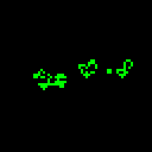

# LIFE



康威生命游戏，跑在**环面**上——左右相接、上下相接，没有边界，所以图案飘出去会从另一头
回来，不会撞墙撞死。格子 2 px 一个，网格尺寸跟着校准后的虚拟屏幕走。

生命游戏当屏保有个老问题：跑上一阵子多半会稳定成一堆静物和振荡子，看着就不动了。
所以它自己盯着局面：**活细胞归零就重新撒种**；**活细胞数在最近 48 代里的波动不超过 2 个**
（且已经跑够 80 代）就判定"无聊了"，往里丢一只滑翔机。滑翔机会撞进静物堆里把它推乱，
比整盘重开温和，也不会打断你正在看的东西。

四套起手图案：

| 图案 | 内容 |
|---|---|
| SAVER | 随机撒种，最通用 |
| GUN | Gosper 滑翔机枪（需要至少 36×9 格） |
| SWARM | 密集随机 |
| MIX | 枪 + 随机的混合 |

## 菜单（Enter）

| 项 | 取值 |
|---|---|
| SPEED | FAST / MED / SLOW / V.SLOW |
| COLOR | 全屏取色器，活细胞的颜色 |
| PATTERN | SAVER / GUN / SWARM / MIX |

## 直接按键

| 键 | 功能 |
|---|---|
| ← / → / ↑ / ↓ | 换图案 |
| `-` / `=` | 速度 |
| Space | 立刻重新撒种 |
| Enter | 打开菜单 |
| Esc | 退出回启动器 |

## 构建与安装

以下命令在仓库根目录下执行（`KB=keyboards/ydkb/athena75_rgb_advanced`）：

```bash
bash $KB/src/app/tools/build_app.sh life        # -> artifacts/apps/life.app
host_tool app install artifacts/apps/life.app
```

---

通用操作与设置落盘规则见 [`docs/usage.md`](../../../docs/usage.md)；
app 一览见[仓库根 readme](../../../../../../readme.md#预置-app)。
