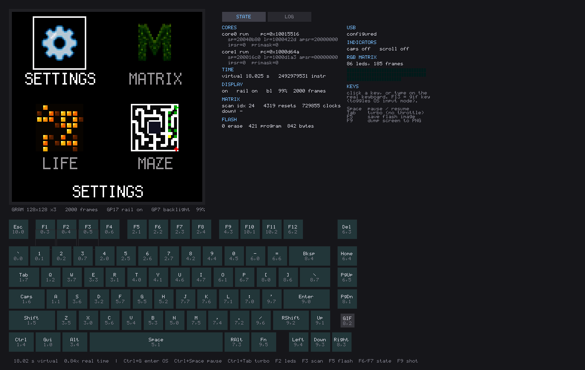

# athena_sim — full-system emulator for athena75_rgb_advanced

Runs the **shipped firmware and apps unmodified**: no `#ifdef SIMULATOR`, no
special build. `artifacts/firmware/*.uf2` is loaded into a 16 MiB flash image and
executed from reset by an ARMv6-M interpreter, through the real bootrom entry
points, the real ChibiOS scheduler, the real USB enumeration, and out to a
modelled GC9107 panel and WS2812 chain.

Commands run from the repo root, which is where `artifacts/` is, with
`KB=keyboards/ydkb/athena75_rgb_advanced`:

    bash $KB/tools/build_sim.sh          # -> artifacts/sim/<os>/athena_sim{,_cli}
    bash $KB/tools/build_sim.sh --test   # ... and run the pixel regression

This file is how to use it. How it is built inside — the machine model, the
scheduler, and the three ways it runs guest code — is `docs/simulator.md`.

Objects stay in the keyboard's `build/sim/`; the executables are archived and
committed — see `artifacts/sim/readme.txt`. Paths below say `macos`; substitute
your own.

macOS and Windows are the two builds there are, from the same sources;
`core/os.h` is where the sockets, the monotonic clock and the "where am I
installed" questions stop being POSIX. On Windows the build is MSVC, driven from
WSL, and that is also what to build from WSL — there is no Linux target:

    bash $KB/tools/build_sim.sh --windows          # -> artifacts/sim/windows/*.exe
    bash $KB/tools/build_sim.sh --windows --no-sdl # headless only, no SDL2
    bash $KB/tools/run_sim.sh   --windows          # the native window, from WSL

Both platforms build their own static SDL2 rather than link whatever the machine
has installed: the sources are fetched and compiled once into `build/sdl2/`,
which is a cache that outlives `--clean`. Delete it to force a rebuild, or point
`ATHENA_SDL2_DIR` at an SDL2 install of your own to skip the whole step. On
Windows the MSVC runtime is static too (`ATHENA_SIM_STATIC_VCRT`, paired with
SDL's `SDL_FORCE_STATIC_VCRT`), so `athena_sim.exe` is one self-contained file.

`--app` additionally wraps the window build in the shape its desktop expects — a
`.app` on macOS, a program folder on Windows — each carrying the firmware and
layout it needs so it can be double-clicked with no command line at all. See
`artifacts/sim/readme.txt` for what goes in one and where its flash ends up.

## The two front ends

`athena_sim` is one SDL2 window: the 128x128 panel on the left, the virtual
keyboard below it, and a state/log panel on the right. Click a key or type on
your real keyboard — either way it closes a matrix intersection and the firmware
finds it by walking the GP6/GP7 shift chain, exactly as on hardware. Keycaps are
tinted with the live WS2812 colour under them.

That picture is itself emulator output: `tools/sim_screenshot.sh` boots a machine,
drives the launcher, and has the window write itself out with `--shot`.

    artifacts/sim/macos/athena_sim --uf2 artifacts/firmware/ydkb_athena75_rgb_advanced_vial.uf2 \
                         --flash flash.bin

| Key | |
|-----|---|
| `Ctrl+Space` | pause (plain Space is a matrix key) |
| `Ctrl+Tab` | turbo — stop pacing to real time |
| `F5` | write the flash image back to `--flash` |
| `F6` / `F7` | save / reload the whole machine |
| `F9` | PNG of the panel alone |

The window also takes `--hid-port`, `--ctl-port` and `--gdb`, so host_tool, a
script and a debugger can all be attached to the machine you are watching.

`athena_sim_cli` is the same machine with no window, for scripting and CI:

    artifacts/sim/macos/athena_sim_cli --uf2 <fw.uf2> --flash flash.bin \
        --install-app artifacts/apps/maze.app --run-ms 4000 --png screen.png

## What is modelled

| Area | Notes |
|------|-------|
| CPU | Two ARMv6-M cores, interleaved in one thread; exceptions, PendSV/SVC, `EXC_RETURN`, MSP/PSP banking |
| Boot | Synthetic bootrom (HLE flash routines), real boot2 executed out of SRAM |
| Flash | W25Q128 at command level (JEDEC `EF 40 18`), 4 KiB erase, 256 B page program, all four XIP alias windows |
| Clocks | RESETS/XOSC/PLL/CLOCKS/WATCHDOG — every ready and lock bit asserts immediately |
| Timing | TIMER with four alarms drives the ChibiOS tick; per-core NVIC |
| SIO | Inter-core FIFO (including the core1 launch handshake), spinlocks, and the **per-core** divider and interpolators |
| USB | Device controller + DPSRAM + a virtual host that completes standard enumeration |
| LCD | PL022 SPI1 into a GC9107 slave: CASET/RASET/RAMWR, the +2/+1 viewport offset, INVON, a real 128x128 GRAM |
| Matrix | The 88-stage GP6/GP7 shift chain, GP8/9/10 direct inputs, and GP7's double duty as the backlight |
| RGB | DMA-paced PIO0 TX FIFO decoded into 86 WS2812 LEDs |

Not modelled: cycle accuracy, the USB physical layer, and PIO as an instruction
set (the FIFO words are decoded directly, which is all the WS2812 program does).

## Talking to it with the real host_tool

The emulated Raw HID interface can be published on a TCP port, and `host_tool`
has a matching backend, so every command works against the emulator unchanged:

    artifacts/sim/macos/athena_sim_cli --uf2 <fw.uf2> --flash flash.bin --realtime --hid-port 4711
    export ATHENA_HID_SIM=127.0.0.1:4711
    host_tool diag / probe jedec / snapshot -o s.png / backup -o ee.bin / app install maze.app

A real keyboard and several emulators can be up together: `host_tool devices`
lists them all and `--device sim:127.0.0.1:4711` picks this one for a single
command, which is the same thing without the exported environment variable.

`--realtime` matters here: the emulator runs at roughly three quarters of real
speed, so without it `host_tool`'s wall-clock timeouts are correspondingly
tighter. `--host-mhz` reports what that costs per guest instruction, and
`--prof-blocks` reports the shape of the code it is spending it on.

Commands that need an on-screen confirmation (`app install`, `restore`) want a
keypress. The GUI takes `--hid-port` too, and there the nicer answer is to watch
the firmware draw its `LOAD APP` box and click INSTALL with the mouse. Headless,
use the control socket.

## Control socket

`--ctl-port N` accepts one command per line, one reply per line:

| Command | Effect |
|---------|--------|
| `key 9,0[,MS]` | tap a matrix position for MS *virtual* ms (default 40) |
| `down 9,0` / `up 9,0` | press and hold / release |
| `shot out.png` | dump the panel GRAM |
| `leds` | WS2812 chain summary |
| `state` | one line of machine state |
| `log usb=debug` | retune logging while it runs |
| `save f.state` / `load f.state` | whole-machine save and restore |
| `quit` | stop, flushing the flash image |

Enter is `9,0`, which is what confirms an install dialog.

## Debugging

- **Logging** is per-domain and per-level: `--log 'usb=debug,lcd=trace,*=info'`,
  or `ATHENA_SIM_LOG`, or the checkboxes in the GUI panel. `--log-file` writes
  JSONL. Scheduling is deterministic, so two runs of the same input produce
  logs that diff line for line.
- **Symbols**: pass `--elf .build/*.elf` and PCs are reported as
  `matrix_scan+0x1a` in logs, traces, breakpoints, and the profiler.
- **GDB**: `--gdb 3333` (add `--gdb-wait` to halt at reset), then
  `arm-none-eabi-gdb .build/*.elf -ex 'target remote :3333'`. The two cores show
  up as threads 1 and 2.
- **Save states** capture the whole machine including flash, and restore
  bit-exactly: resuming a state and running further lands on the same
  instruction count as an uninterrupted run.
- Also available: `--trace-file` instruction traces, `--watch ADDR[,LEN]`
  memory watchpoints, `--break SYM|ADDR`, `--strict-mmio`, and a sampling
  profiler printed at the end of every run.

## How it runs guest code

Three ways, from the slowest and simplest to the fastest, all of which retire the
same instructions in the same order:

| | |
|---|---|
| `--no-jit` | one instruction at a time; the reference implementation |
| `--jit` | a basic block at a time, decoded once and cached |
| `--jit-native` | those blocks as host machine code — **the default** |

There is a backend for x86-64 and one for arm64 (`jit/jit_x64.c`, `jit/jit_a64.c`);
anywhere else, `--jit-native` quietly means `--jit`. On an M4 a fourteen-second run
of the firmware goes 0.79x realtime interpreted, 0.93x in blocks, and 1.46x with
machine code — 32 host cycles per guest instruction down to 17.

Emitted code covers the common encodings and hands the rest — PUSH/POP, LDM/STM, the
high-register forms, shifts by a register — to the interpreter one instruction at a
time from inside the block, which is why about 95% of retired instructions are native
even though the covered set is smaller than that. Loads inline the SRAM case; stores
always go through the bus, so a store to MMIO, to a granule holding translated code,
or to flash behaves exactly as it does interpreted.

Anything that wants to see instructions individually turns machine code off by
itself: a breakpoint, a watchpoint, `--trace`, `--prof-blocks`, and GDB single-step
all fall back for as long as they are armed. Two ways to check the rest:

    athena_sim_cli ... --jit-verify      # re-read the guest bytes under every block
    $KB/tools/sim_regress.py --extra=--no-jit && $KB/tools/sim_regress.py --extra=--jit-native

## Regression tests

`tools/sim_regress.py` boots each case from a blank flash, drives keys, and
compares the panel dump against `tests/golden/`. Matches are byte-exact rather
than approximate, so any difference is a real behaviour change. The emulator's
RGB565→RGB888 conversion is identical to `src/host/common/`'s, which means a
golden can also be recorded from real hardware with `host_tool snapshot`.

    $KB/tools/sim_regress.py                    # check
    $KB/tools/sim_regress.py --bless            # re-record
    $KB/tools/sim_regress.py --case launcher    # one case
